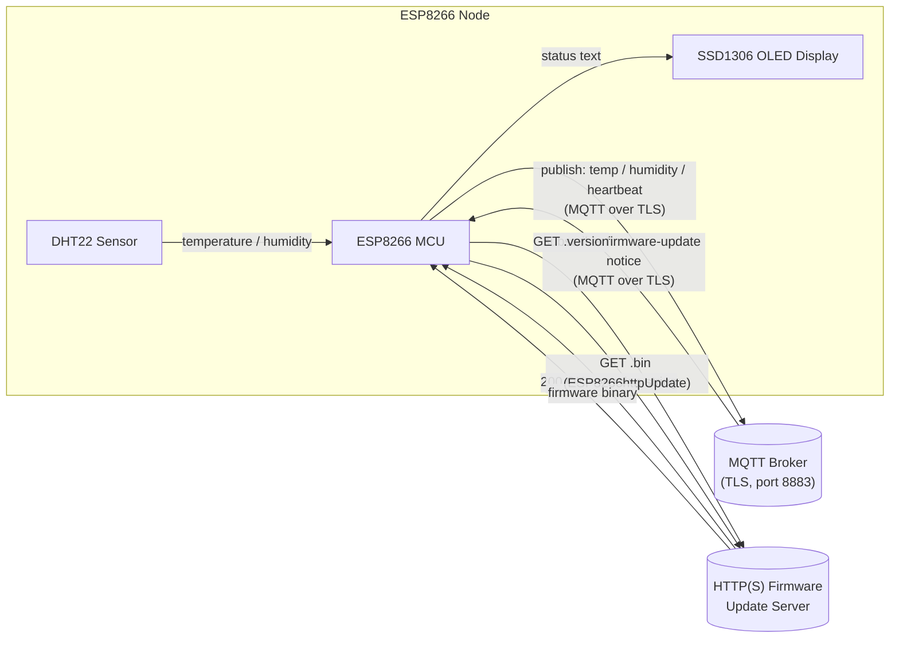

# ESP8266 MQTT/SSL Sensor Node with OLED Status Display and HTTP OTA Update

An ESP8266 sketch that reads temperature and humidity from a DHT22 sensor,
publishes the readings to an MQTT broker over TLS, shows live Wi-Fi/MQTT/
firmware status on an SSD1306 OLED, and checks a remote server for newer
firmware to install over-the-air.

## What it does

1. Connects to Wi-Fi and syncs the clock over SNTP.
2. Connects to an MQTT broker on port 8883 using `WiFiClientSecure`
   (BearSSL) with a pinned root CA certificate, then subscribes to two
   topics used to trigger firmware-update checks.
3. Every 5 seconds, publishes a heartbeat, the running firmware version,
   and DHT22 temperature (C/F) and humidity readings to MQTT topics
   scoped under `HOSTNAME`.
4. On boot, and whenever an MQTT message announces a newer firmware
   version, calls an HTTP endpoint (`<FW_BASE_URL><MAC>.version`) to
   check the latest available version. If newer than the running
   firmware, downloads and flashes `<FW_BASE_URL><MAC>.bin` via
   `ESP8266httpUpdate`.
5. Continuously redraws an SSD1306 OLED showing Wi-Fi status, MQTT
   status, last update timestamp, firmware update status, and the
   current firmware version.

Note: the firmware update channel itself is plain HTTP (`fwUrlBase`
defaults to `http://...`) while the MQTT channel is TLS-encrypted — see
the diagram below. If you want the OTA channel encrypted too, point
`FW_BASE_URL` at an `https://` endpoint (the `ESP8266httpUpdate` library
supports this, but that is not how this sketch is wired by default).

## Architecture



## Hardware

| Component            | Notes                                   |
|-----------------------|------------------------------------------|
| ESP8266 board          | e.g. NodeMCU v2/v3, Wemos D1 mini        |
| SSD1306 OLED (I2C)     | 0.96" 128x64, address `0x3c`              |
| DHT22 (AM2302)         | Temperature/humidity sensor              |

### Wiring

| Signal        | ESP8266 pin | Notes                     |
|---------------|-------------|---------------------------|
| OLED SDA      | GPIO 5 (D1) | I2C data                  |
| OLED SCL      | GPIO 4 (D2) | I2C clock                 |
| DHT22 data    | GPIO 12 (D6)| Add a 10k pull-up to 3V3  |
| Status LED    | D0          | Onboard blink each loop   |

## Required libraries

- `ESP8266WiFi`, `ESP8266HTTPClient`, `ESP8266httpUpdate` (bundled with
  the ESP8266 Arduino core)
- [PubSubClient](https://github.com/knolleary/pubsubclient) (MQTT client)
- [ArduinoJson](https://arduinojson.org/) v7+
- [DHT sensor library](https://github.com/adafruit/DHT-sensor-library) +
  Adafruit Unified Sensor
- [ESP8266 and ESP32 OLED driver for SSD1306 displays](https://github.com/ThingPulse/esp8266-oled-ssd1306)
  (provides `SSD1306Brzo.h`)

## Configuration

Copy `secrets.example.h` to `secrets.h` (git-ignored — never commit real
credentials) and fill in:

- `WIFI_SSID` / `WIFI_PASS`
- `MQTT_HOST`, `MQTT_PORT`, `MQTT_USER`, `MQTT_PASS`
- `FW_BASE_URL` — base URL the device checks for `.version`/`.bin` files
- `ROOT_CA_CERT` — the CA certificate that signed your MQTT broker's TLS
  certificate (`openssl s_client -connect <host>:8883 -showcerts`)

Non-secret settings such as the MQTT topic prefix (`HOSTNAME`) and
`FW_VERSION` live directly in `IoT_ESP8266_MCU_OLED.ino` — bump
`FW_VERSION`/`IOT_FW_VER` on every release you publish to the update
server.

## Build & flash

### PlatformIO

```
pio run -t upload
pio device monitor -b 115200
```

`platformio.ini` pins the required library versions for a reproducible
build.

### Arduino IDE

1. Install the libraries listed above via Library Manager.
2. Open `IoT_ESP8266_MCU_OLED.ino` directly (the IDE will pick up
   `secrets.h` from the same sketch folder automatically).
3. Select an ESP8266 board (e.g. "NodeMCU 1.0 (ESP-12E Module)").
4. Upload.

## Verification

This sketch targets ESP8266 hardware and TLS/OTA infrastructure that
isn't available in this environment, and neither `platformio` nor
`arduino-cli` is installed here, so the build could not be compiled or
flashed as part of this change. Review the diff carefully and build
locally with PlatformIO or the Arduino IDE before flashing a device.
